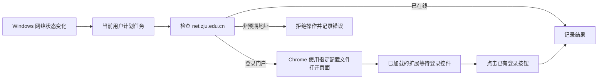

# ZJU Network Auto Login

这是一个面向 Windows 和 Google Chrome 的浙大校园网辅助工具。PowerShell 任务在 Windows 网络连通性状态变化后检测浙江大学网络门户；发现指定的 HTTPS 登录页时，使用已有 Chrome 配置文件打开该页面。Chrome 扩展只在 `https://net.zju.edu.cn/*` 的登录页等待并点击登录按钮，不读取账号、密码、Cookie，也不请求网络 API。

> 本项目为个人维护的非官方工具，与浙江大学、浙江大学网络与信息化中心及校园网运营方均无隶属、授权或背书关系。请遵守学校网络、账号和信息安全规定，并自行承担使用风险。

## English summary

Windows helper for the ZJU captive portal. A current-user scheduled task opens the approved ZJU portal in Chrome when Windows reports a network change; the unpacked Chrome extension clicks the portal's existing login button. It never stores or reads credentials. This is an unofficial project and is not affiliated with Zhejiang University.

## 要求

- Windows 10/11，Windows PowerShell 5.1 或更高版本。
- 已安装 Google Chrome，并已使用目标 Chrome 配置文件登录校园网一次。
- 对该配置文件允许 Chrome 保存校园网密码。工具本身不保存、导出或读取密码。
- 可运行当前用户的计划任务；安装不需要管理员权限。

## 安装

1. 下载或克隆本仓库到一个不会移动或删除的位置。计划任务直接引用仓库内的脚本。
2. 如需指定门户地址、冷却时间、Chrome 路径或配置文件，复制 `config.example.json` 为 `config.json` 并修改。未创建 `config.json` 时使用内置默认值。
3. 在 Chrome 中手动访问校园网登录页面，完成一次正常登录，并在 Chrome 提示时保存密码。
4. 打开 `chrome://extensions`，启用“开发者模式”，选择“加载已解压的扩展程序”，并选择本仓库的 `chrome-extension` 目录。
5. 在仓库根目录运行：

```powershell
powershell -ExecutionPolicy Bypass -File .\scripts\Install.ps1
```

如配置文件不在仓库根目录，可显式指定：

```powershell
powershell -ExecutionPolicy Bypass -File .\scripts\Install.ps1 -ConfigPath C:\path\to\config.json
```

安装完成后会输出 Chrome 扩展目录。安装脚本注册当前用户计划任务 `ZJU Network Auto Login`，不会复制程序到其他目录。

## 卸载

在仓库根目录运行：

```powershell
powershell -ExecutionPolicy Bypass -File .\scripts\Uninstall.ps1
```

卸载仅删除计划任务。`config.json`、日志和状态文件会被保留；如不再需要，也可手动删除它们以及 Chrome 扩展。

## 配置与日志

`config.json` 可设置以下字段：

- `PortalUrl`: 默认 `https://net.zju.edu.cn`，仅接受 `net.zju.edu.cn` 的 HTTPS 地址。
- `CooldownSeconds`: 默认 `300`，两次自动尝试之间的最短秒数。
- `ChromeExecutable`: 留空时自动查找标准 Google Chrome 安装位置。
- `ChromeProfile`: 默认 `Default`；其他配置文件通常为 `Profile 1`、`Profile 2` 等。

运行状态写入 `%LOCALAPPDATA%\ZjuNetworkAutoLogin\state.json`，活动日志写入 `%LOCALAPPDATA%\ZjuNetworkAutoLogin\logs\activity.log`。可用以下方式进行一次不联网的判断测试：

```powershell
.\scripts\Invoke-ZjuNetworkAuth.ps1 -DryRun -CurrentUrl 'https://net.zju.edu.cn/srun_portal_pc?ac_id=80'
```

## 工作流程



## 排查

- **任务没有触发：** 在“任务计划程序”中确认 `ZJU Network Auto Login` 存在，并检查活动日志中的错误。
- **找不到 Chrome：** 确认已安装 Google Chrome；或在 `config.json` 中填写标准 Chrome 可执行文件路径。
- **打开页面后未登录：** 确认扩展已启用、选择的是本仓库的 `chrome-extension` 目录，并先在同一 Chrome 配置文件中手动登录并保存密码。
- **使用了错误的配置文件：** 在 `config.json` 修改 `ChromeProfile`，例如 `Profile 1`；不要填写完整目录路径。
- **仓库移动后失效：** 重新运行 `Install.ps1`，让任务指向新的仓库位置。

## 打包发布

在仓库根目录运行：

```powershell
powershell -ExecutionPolicy Bypass -File .\tools\New-ReleasePackage.ps1
```

该命令生成 `dist\zju-network-auto-login-v1.0.0.zip`，其中只包含 `scripts`、`chrome-extension`、`config.example.json`、`README.md` 和 `LICENSE`。
