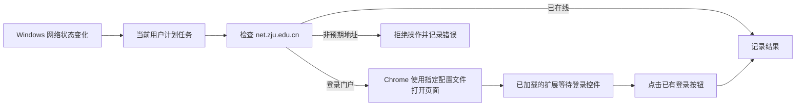

# ZJU Network Auto Login

浙大校园网每半个月需要重新认证一次。对于放在机房、办公室的服务器来说，认证失效后网络会中断，远程桌面、SSH 和其他服务也会断开。这个工具可以自动打开校园网认证页面，由 Chrome 自动填充已保存的账号密码，再自动点击登录按钮，帮助设备恢复网络。

工具由 Windows PowerShell 脚本和 Chrome 扩展组成。Windows 检测到网络认证状态变化后，脚本会访问浙大校园网门户；确认需要认证时，使用指定的 Chrome 配置文件打开登录页面。Chrome 扩展只在浙大校园网登录页面中查找并点击登录按钮，不读取账号、密码、Cookie 或表单内容。使用前需要先在 Chrome 中手动登录一次并保存密码，再加载本项目的 Chrome 扩展。脚本通过 Windows 的 NCSI 4038 网络事件触发，运行状态和日志保存在 %LOCALAPPDATA%\ZjuNetworkAutoLogin。

> 本项目为个人维护的非官方工具，与浙江大学、浙江大学网络与信息化中心及校园网运营方均无隶属、授权或背书关系。请遵守学校网络、账号和信息安全规定，并自行承担使用风险。

## English summary

ZJU campus network requires re-authentication every two weeks. For servers in machine rooms or offices, an expired authentication session can interrupt the network and disconnect remote desktop, SSH, and other services. This tool opens the campus authentication page, lets Chrome fill its saved credentials, and automatically clicks the Login button to help the device recover its network connection. It consists of a Windows PowerShell script and a Chrome extension. The script responds to Windows network-status changes and uses the specified Chrome profile; the extension only finds and clicks the login button on the ZJU campus login page and does not read credentials, cookies, or form contents. Before use, log in once and save the password in Chrome, then load this Chrome extension. The script is triggered by Windows NCSI event 4038, with runtime state and logs stored in `%LOCALAPPDATA%\ZjuNetworkAutoLogin`.

## 要求

- Windows 10/11，Windows PowerShell 5.1 或更高版本。
- 已安装 Google Chrome，并已使用目标 Chrome 配置文件登录校园网一次。
- 对该配置文件允许 Chrome 保存校园网密码。工具本身不保存、导出或读取密码。
- 可运行当前用户的计划任务；安装不需要管理员权限。

## 安装

1. 下载或克隆本仓库到一个不会移动或删除的位置。计划任务直接引用仓库内的脚本。
2. 如需指定门户地址、冷却时间、Chrome 路径或配置文件，复制 `config.example.json` 为 `config.json` 并修改。未创建 `config.json` 时使用内置默认值。
3. 在 Chrome 中手动访问校园网登录页面，完成一次正常登录，并在 Chrome 提示时保存密码。
4. 打开 `chrome://extensions`，启用“开发者模式”，选择“加载已解压的扩展程序”，并选择本仓库的 `chrome-extension` 目录。
5. 在仓库根目录运行：

```powershell
powershell -ExecutionPolicy Bypass -File .\scripts\Install.ps1
```

如配置文件不在仓库根目录，可显式指定：

```powershell
powershell -ExecutionPolicy Bypass -File .\scripts\Install.ps1 -ConfigPath C:\path\to\config.json
```

安装完成后会输出 Chrome 扩展目录。安装脚本注册当前用户计划任务 `ZJU Network Auto Login`，不会复制程序到其他目录。

## 卸载

在仓库根目录运行：

```powershell
powershell -ExecutionPolicy Bypass -File .\scripts\Uninstall.ps1
```

卸载仅删除计划任务。`config.json`、日志和状态文件会被保留；如不再需要，也可手动删除它们以及 Chrome 扩展。

## 配置与日志

`config.json` 可设置以下字段：

- `PortalUrl`: 默认 `https://net.zju.edu.cn`，仅接受 `net.zju.edu.cn` 的 HTTPS 地址。
- `CooldownSeconds`: 默认 `300`，两次自动尝试之间的最短秒数。
- `ChromeExecutable`: 留空时自动查找标准 Google Chrome 安装位置。
- `ChromeProfile`: 默认 `Default`；其他配置文件通常为 `Profile 1`、`Profile 2` 等。

运行状态写入 `%LOCALAPPDATA%\ZjuNetworkAutoLogin\state.json`，活动日志写入 `%LOCALAPPDATA%\ZjuNetworkAutoLogin\logs\activity.log`。可用以下方式进行一次不联网的判断测试：

```powershell
.\scripts\Invoke-ZjuNetworkAuth.ps1 -DryRun -CurrentUrl 'https://net.zju.edu.cn/srun_portal_pc?ac_id=80'
```

## 工作流程



## 排查

- **任务没有触发：** 在“任务计划程序”中确认 `ZJU Network Auto Login` 存在，并检查活动日志中的错误。
- **找不到 Chrome：** 确认已安装 Google Chrome；或在 `config.json` 中填写标准 Chrome 可执行文件路径。
- **打开页面后未登录：** 确认扩展已启用、选择的是本仓库的 `chrome-extension` 目录，并先在同一 Chrome 配置文件中手动登录并保存密码。
- **使用了错误的配置文件：** 在 `config.json` 修改 `ChromeProfile`，例如 `Profile 1`；不要填写完整目录路径。
- **仓库移动后失效：** 重新运行 `Install.ps1`，让任务指向新的仓库位置。

## 打包发布

在仓库根目录运行：

```powershell
powershell -ExecutionPolicy Bypass -File .\tools\New-ReleasePackage.ps1
```

该命令生成 `dist\zju-network-auto-login-v1.0.0.zip`，其中只包含 `scripts`、`chrome-extension`、`config.example.json`、`README.md` 和 `LICENSE`。
